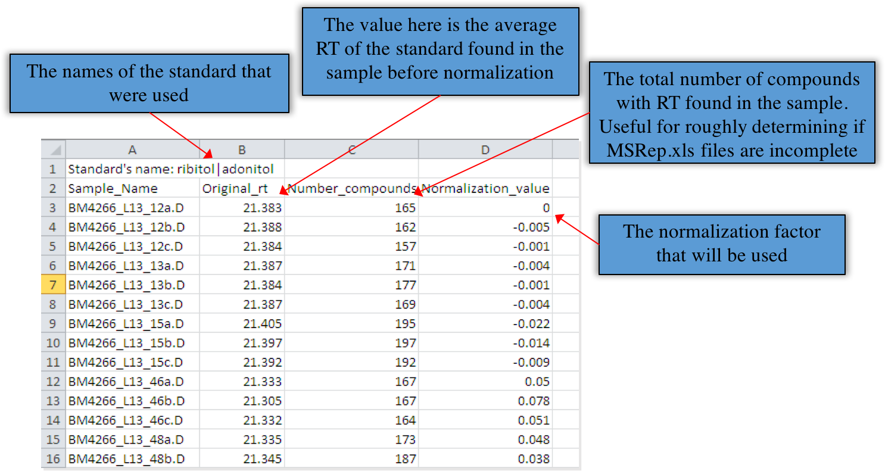
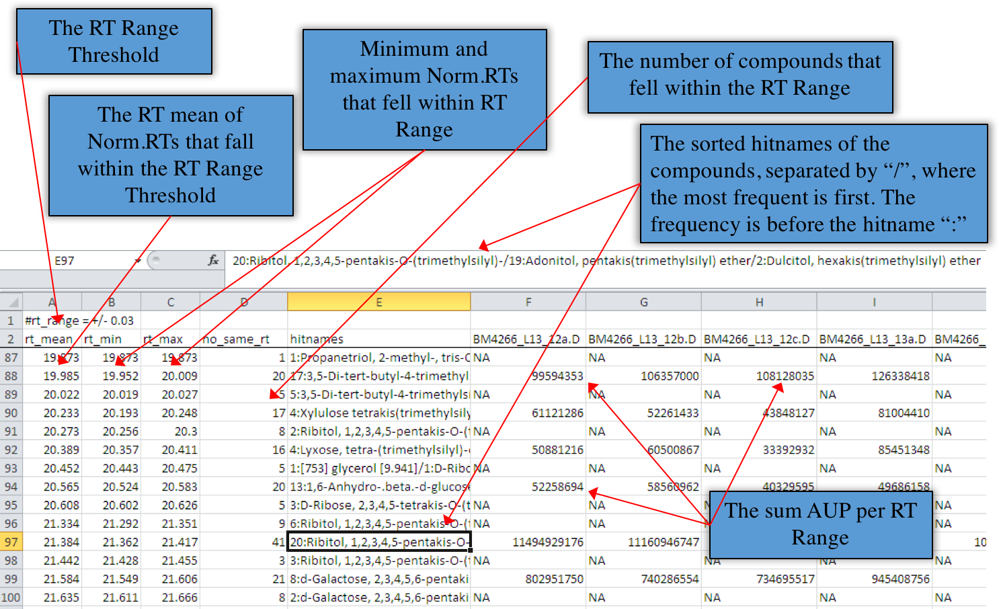
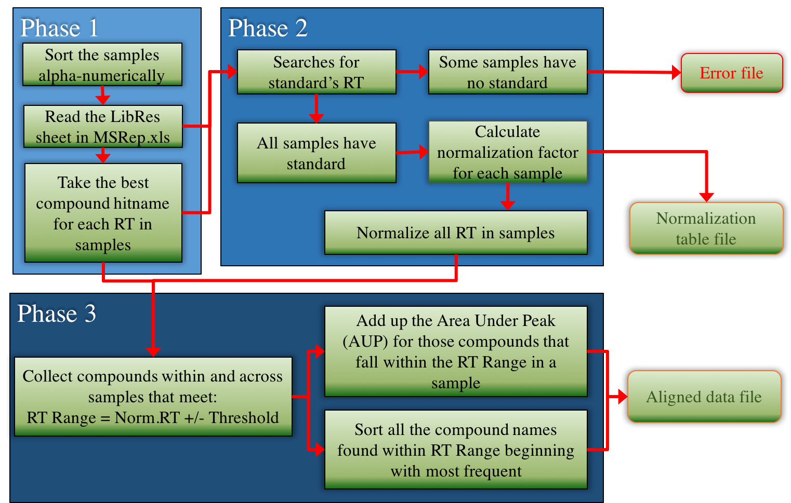

# GCMS Report Extractor #

The GCMS Report Extractor program (written in [Perl](https://www.perl.org/)) was designed to process GCMS data generated from Agilent's Enhanced Chemstation (vE.02.02.1431) software. It was created to help scientists align their samples in an experiment relatively quickly and easily.

The program is able to:

1. Normalize the retention time (RT) between samples using standards.
2. Output the sorted compound names found in samples by frequency in an experiment.
3. Extract and report the pertinent data for optimizating alignments.
4. Run in Windows (with compiled .exe).

Required perl module if running the perl script: [Spreadsheet::ParseExcel](http://search.cpan.org/~dougw/Spreadsheet-ParseExcel-0.65/lib/Spreadsheet/ParseExcel.pm)

## HOWTO ##
Before starting, ensure the following about your data:

* Each sample is a directory (folder) with a unique name.
* In each sample directory, there is the `MSRep.xls` file.
* All samples directories are placed in one single main directory, which should be all the samples in one experiment in which you wish to conduct alignment.

**Execution:**

1. Double click to run the Windows executable, or run the following command in a console:

	`perl GCMS_report_extractor.pl`

2. Input the experiment directory's full path as the main directory and press enter. HINT: you can drag and drop your main directory into the console to easily generate the path. It should look something like this:

	`Enter the main directory: C:\experiment1\main_directory`

3. Input your threshold. This is where you decide what is the plus minus range of your RT to be considered an identical hit for alignment. Press enter.

	`Enter your threshold: 0.03`

4. Input the names of your standard. You CANNOT use special characters and spaces as input, and the search is NOT case-sensitive. You can use more than one name for the standard as input by separating them with a pipe (`|`). This will mean they will be regarded as the same compound. Press enter.

	`Enter your standard(s) name: ribitol|adonitol`

5. Input the standard’s estimated RT range. Since it is possible that compound name hits could occur at odd RTs, it is important to narrow it to an expected RT range to reduce error in normalization values. The start and end range should be separated by a hyphen (`-`) with no spaces. Press enter.

	`Enter your standard's estimated rt range: 21-22`
	
6. Finally, input the name of your output file.

	`Enter your output file name: myresults.tab`

After you have given the name, just enter and wait.
The program will talk to itself while it works, which is a healthy thing. It will tell you the following:

* In what order the samples are sorted.
* Highlight the samples with no standards.
* When it is halfway to completion.
* When it has completed generating output files.

When running through the Windows executable, the program window will close once the run is completed.

## What is the output? ##
The program generates two types of results (two files):

1. **Normalization table**: a tab-delimited file of the normalization factor used for each sample, the original RT time of the standard and the number of compounds detected. Example:

2. **Alignment table**: a tab-delimited file of the final normalized and aligned data. Example:

If the program finds samples in the experiment that do not contain any of the standard’s names, the program will stop and generate a single error file. It will indicate the samples that are causing the error.
	Example file: `myresults.tab.err`

## How does it work? ##

For calculating the normalization factor, the first sample after sorting will be used as the base. Then, the difference in RT of the standard between samples will become the normalization factor when comparing the rest of the other samples. I.e. using Ribitol as the standard, if Sample 1 has it at RT 21.75 and Sample 2 at RT 21.95, then the norm factor for Sample 1 is 0 while Sample 2 is -0.2.
The normalization factor works by addition. So with the example, Sample 1’s compound RTs are unchanged, while Sample 2’s compound RTs will be plus -0.2.
If there are two or more standards picked up in a sample, then the average RT for that standard will be taken. The RT range in which this can occur is set by the user as the “standard’s estimated RT range”. Following previous example, if the user has set the range as 21-22 RT and Sample 2 had another Ribitol at 22.05,  then the average of that standard ((22.05+21.95)/2=22) will be used to calculate the normalization factor (21.75–22 = -0.25).

## Optimization ##
1. **Standard’s estimated RT range**: This will affect normalization between samples, and thus the downstream analysis. It is crucial to tweak this so that it is as narrow as possible, yet able to make certain all samples get a reading at the same RT Range for the standard. 
 
2. **RT Range threshold**: This dictates the precision of the alignments. Too narrow and there will be too few that gets aligned, while being too broad will cause inaccuracies in compound representation. 

## AUTHOR & COPYRIGHT ##
GCMS Report Extractor was developed by Joel Z.B. Low & Theresa L.M. Ng

Copyright is under MIT license (see LICENSE.txt).
